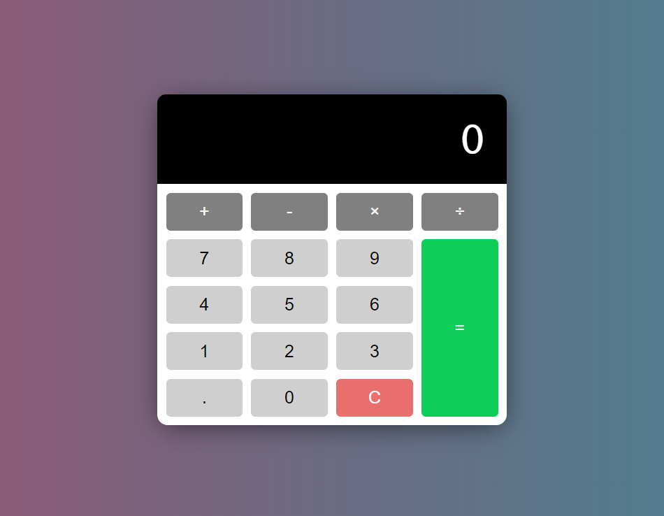

[calculator-url]: https://amssdias.github.io/ztm-calculator/

# Calculator

    

Welcome to the Calculator project! This is a simple and intuitive web application that allows you to perform basic arithmetic operations including addition, subtraction, multiplication, and division.

## Features

- **Addition:** Add two numbers.
- **Subtraction:** Subtract one number from another.
- **Multiplication:** Multiply two numbers.
- **Division:** Divide one number by another.
- **Clear Functionality:** Reset the calculator to perform a new calculation.
- **Responsive Design:** Works well on both desktop and mobile devices.

## Live Demo

Try out the calculator directly in your browser by clicking the link below: [Calculator][calculator-url]

